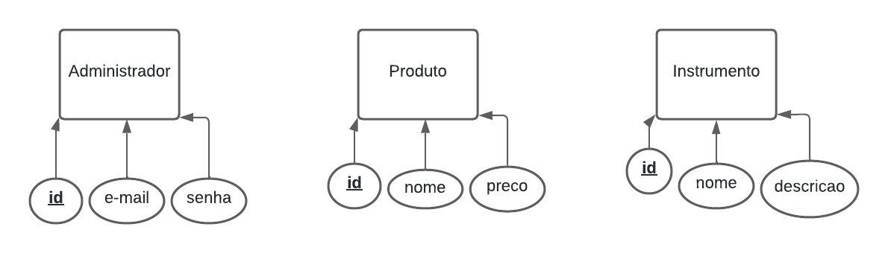

# Trabalho-final-WEB
Trabalho final da disciplina de WEB

### Integrantes

 Fernanda Barbosa Rodrigues, Gabriela Martins Matos Gomes, Heloísa Almeida Miranda, Kamila Santiago dos Santos e Luiza Emanuelle Soares Dias.

### ESCOLA DE MÚSICA NÚBIA ROCHA

O site tem como objetivo expandir as vendas e apresentar de forma mais organizada o institucional da empresa.

# Principais funcionalidades
1. Menu, no qual é só clicar na seção desejada e você é redirecionado para ela
2. Carrosel de imagens na aba LOCAL
3. Quando um produto é clicado, a página o redireciona para o whatsapp da escola
4. Possibilidade de alterar os professores, intrumentos e aulas ofertadas
5. Possibilidade de alterar os produtos

Wireframes: https://www.figma.com/proto/nhEq3Nmu9psdwfhwyPgx3N/Wireframes?node-id=0-1&t=OAPtGLksDiCVoTo7-1   

https://www.figma.com/proto/nhEq3Nmu9psdwfhwyPgx3N/Wireframes?node-id=33-67&p=f&t=7VkKplR0xh1RcVTN-0&scaling=min-zoom&content-scaling=fixed&page-id=33%3A48&starting-point-node-id=33%3A67

# Banco de Dados
# Modelo conceitual

O modelo conceitual representa a estrutura de dados de um sistema voltado para o gerenciamento de produtos e instrumentos, administrado por usuários com acesso restrito.

O diagrama é composto por três entidades principais:

 - Administrador

 - Produto

 - Instrumento

Entidade: Administrador

Representa o usuário responsável por gerenciar o sistema.
Possui os seguintes atributos:

id: identificador único do administrador;

e-mail: utilizado para login;

senha: usada para autenticação no sistema.

Entidade: Produto

Armazena as informações relacionadas aos produtos disponíveis.
Possui os atributos:

id: identificador único do produto;

nome: nome do produto;

preço: valor do produto.

Entidade: Instrumento

Armazena os dados dos instrumentos cadastrados no sistema.
Possui os atributos:

id: identificador único do instrumento;

nome: nome do instrumento;

descrição: detalhes ou características do instrumento.

# Modelo lógico

## Modelo Físico

- [📄 DDL.sql](./db/DDL.sql): contém os comandos **CREATE TABLE** para criar as tabelas do banco.
- [💾 DML.sql](./db/DML.sql): contém os comandos **INSERT INTO** para inserir os dados nas tabelas.
